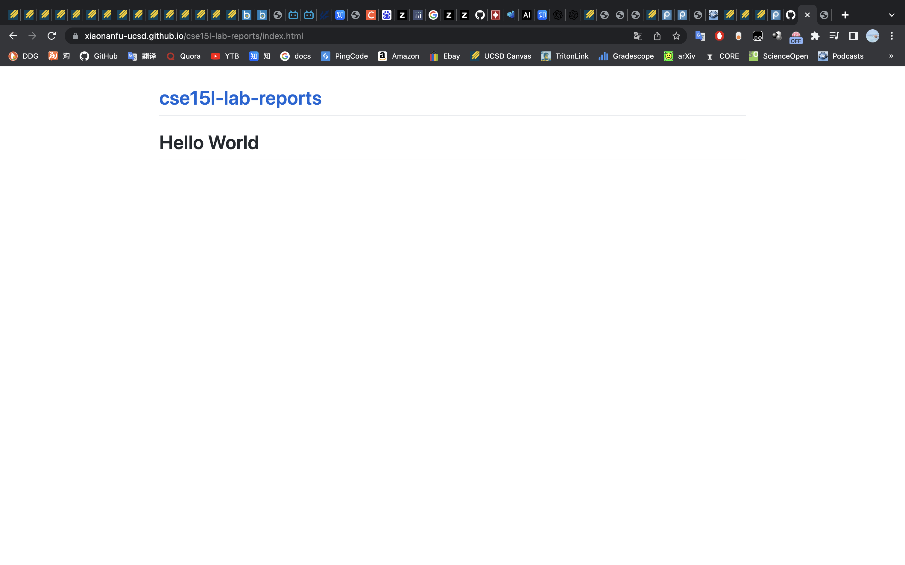

# Hello World



After I commit a new file, the site can show the new webpage if accessing it with the relavent URL. 


Markdown Cheat Sheet 
====== 
[***this is a link to another md file.***](https://xiaonanfu-ucsd.github.io/cse15l-lab-reports/other-file.html)

> Blockquote  
> 1. a  
> 1. b  
> 1. c

Lists:  
* a
* b
* c
* d  
  * d.1
---  
some code
```
console.log("hello world");
```